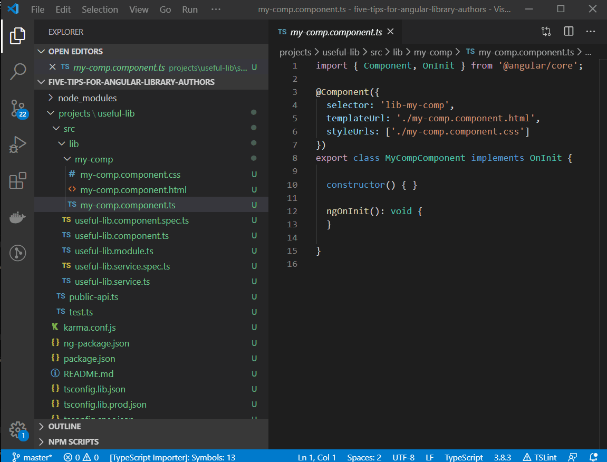
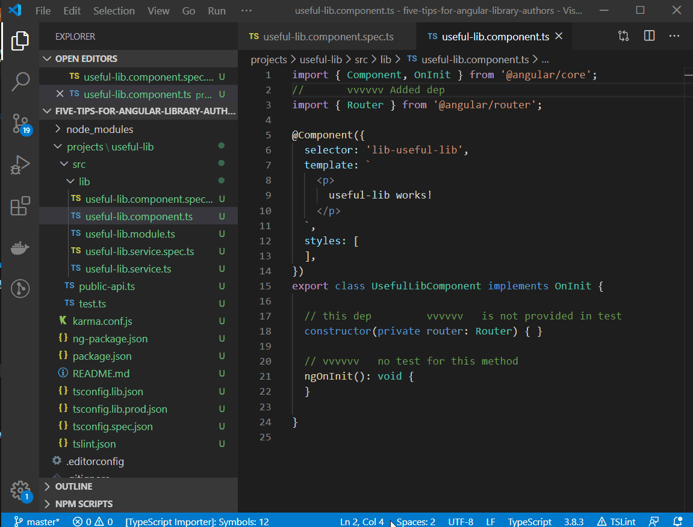

# scuri-code README
 

Like Scuri code? Want to [💸support it](#support-scuri-code)?

## Features

Allows running [SCURI](https://www.npmjs.com/package/scuri) ([github](https://github.com/gparlakov/scuri)) from the comfort of your beloved VS Code.

## Commands

### SCuri Create Spec

Will generate a `.spec` file for the `.ts` file that is currently opened in the VS Code window

### SCuri Create Spec (overwrite)

Will generate a `.spec` file for the `.ts` file that is currently opened in the VS Code window overwriting existing spec if any.

### Scuri Update

Will update the existing `.spec` file for the `.ts` file that is currently opened in the VS Code window

### Scuri Install Dependencies

Will run `npm install --save-dev scuri @angular-devkit/schematics-cli` in the current working folder root to install requirements

## Requirements

It needs to install npm packages `scuri` and `@angular-devkit/schematics-cli` and `typescript`. Just run the `Scuri Install Dependencies` command from the command pallette `F1`/`Ctrl + Shift + p` or any other command and it will do the trick

### Dependency Versions

All `scuri`, `@angular-devkit/schematics-cli`, and `typescript` versions are configurable via the config: `scuri-code.scuri-version`,`scuri-code.angular-schematics-version`, `scuri-code.typescript-version`.

## Known Issues
 - not showing progress on commands Create or Update

## Support scuri code
Via the [github sponsors](https://github.com/sponsors/gparlakov) or

